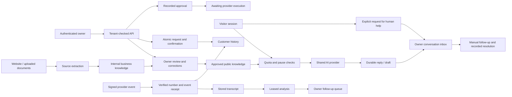

# Pilot runbook

Updated 2026-09-19. This is an execution and verification guide, not a declaration that production is ready.

## Local checks

Use Node 22 or newer and the root application (not the old nested `businessos` directory):

```powershell
npm ci --ignore-scripts
npm run typecheck
npm test
npm run build
npm start -- --hostname 127.0.0.1
```

On this machine the global `npx` shim is broken. Equivalent commands that were used successfully are:

```powershell
node node_modules/typescript/bin/tsc --noEmit --incremental false
node --test tests/*.test.cjs
node node_modules/next/dist/bin/next build
node node_modules/next/dist/bin/next start --hostname 127.0.0.1
```

For npm itself: `node 'C:\Program Files\nodejs\node_modules\npm\bin\npm-cli.js' <arguments>`.

`npm run typecheck` generates Next.js route types before running TypeScript. For a fresh checkout using the direct commands, run `node node_modules/next/dist/bin/next typegen` first. Run type checking and builds sequentially: both use generated files in `.next`.

The recorded local result is **48 passing tests**, strict type checking and a Next.js **16.3.5** production build. `npm audit --json` reported **zero known vulnerabilities** on 2026-09-18. A GitHub Actions workflow with read-only repository permissions in `.github/workflows/checks.yml` runs installation, types, tests and build using inert public configuration placeholders; remote CI has not been run.

For the local production smoke check, start the application on port 3187, then run `node tests/smoke.cjs` in another terminal. It checks 22 signed-out/public routes and supplies no real tenant IDs or credentials. It refuses non-local hosts. A signed-in staging walkthrough is still required.

For widget interaction testing without live services, run `node tests/widget-preview.cjs` and open `http://127.0.0.1:3188`. The page serves the real widget with simulated API responses. This verifies form/layout behavior, not actual request persistence; API and database regression tests cover the latter separately. Stop the fixture with Ctrl+C when finished.

Tests execute actual TypeScript code with provider doubles plus all migrations on PGlite PostgreSQL/pgvector. They do not need real credentials and do not send messages. Strict TypeScript is enabled. The obsolete `next lint` script has been removed; a separate ESLint policy is not yet configured. Local fonts remove the Google-font network dependency during builds.

## Database rollout

The new migration range is **023–035**. Migration 022 and other pre-existing modifications were already in the working tree when this work began.

1. In a disposable Supabase staging project, inspect migration history and back up any existing data before applying unapplied migrations in numerical order. Do not rerun old catch-up scripts blindly against a live database.
2. Confirm the installed vector extension schema and 1024-dimension columns. The new public retrieval and brand replacement functions support `public` and `extensions`; local tests exercise both. Check legacy migrations/functions against the deployed schema as well.
3. Apply 023–035 using the normal Supabase migration workflow. Use a privileged operator connection, not an anonymous browser connection. Application deployment requires these functions; missing migrations deliberately cause affected operations to fail closed. Migration 035 must be present before deploying the updated chat route.
4. Verify two independent auth users/businesses using the actual Supabase anon/authenticated roles. The service-role key bypasses row-level security and must stay server-side.
5. Review legacy invalid contact links before validating the two new `NOT VALID` foreign keys. New writes are constrained immediately; old rows are retained for review.
6. Existing knowledge becomes internal. Owners explicitly approve suitable business facts in My Business. Old unclassified chunks are retained, and legacy editable profile values are conservatively protected because their old provenance is unknown.
7. Deploy to a restricted staging environment, execute the acceptance matrix below, then make a separate production release decision with the concrete diff and migration results.

No migration was applied to the user's hosted database during this task. Do not mark rollout complete based on the PGlite test alone.

### Migration map

| Range | Effect |
|---|---|
| 023 | Duration/resource appointment confirmation with tenant/calendar locking |
| 024 | Public knowledge approvals, durable visitor messages and usage reservations |
| 025 | Verified inbound-number mappings and idempotent voice receipts |
| 026 | Tenant-safe customer resolution, score updates and interaction links |
| 027 | Protected owner corrections and atomic website knowledge replacement |
| 028 | Durable approval decisions distinct from execution |
| 029 | Invoice draft persistence, uniqueness and generation leases |
| 030 | Atomic receptionist pause control |
| 031 | Billing event receipts and state reconciliation |
| 032 | Shared SQL metrics for dashboard and weekly report |
| 033 | Call-analysis leases, bounded attempts and atomic follow-up creation |
| 034 | Retry-safe booking intake and customer history linkage |
| 035 | Conversation history backfill/index, human-help intake, message tracking and owner resolution |

### Recovery

Prefer forward fixes or pause affected agents. Do not recover by granting browser writes to protected tables or deleting receipts. Keep a copy of prior migrations and a tested backup. Restoring the old application alone does not undo new database privileges or schemas.

The Inbox shows website conversations and pending human-help requests. Contact details are visitor-supplied and unverified; do not merge a visitor into a customer account or expose private history based on those details. AI replies pause for that conversation until the owner resolves the request. Resolution is version-checked so a stale tab cannot resolve a reopened request. No email/SMS notification is sent: owners must review the inbox and use their own communication channel. The current summary counter tracks insertion; a future retention/deletion workflow must also reconcile these counters and previews.

An expired call-analysis lease can be reclaimed, up to three provider attempts. Calls at the retry limit need operator review. Quota failures do not consume a provider attempt. The guarded `/api/cron/call-analysis` processes at most five calls; it is **not added to the production schedule** yet. Owners can analyze a stored transcript from Calls. A missing transcript is marked unavailable. This worker still needs fair per-tenant dispatch/backoff before large unattended batches.

Invoice drafts have a ten-minute generation lease. A failed or expired generation may be reclaimed. Existing drafts are reused. Drafting never advances `chase_step`; delivery implementation must recheck invoice state, obtain approval, use a provider idempotency key, record a receipt, and only then advance the step.

New invoice creation stores a draft first. Only an email response with a provider receipt can move it to sent. If email succeeds but the status update fails, the response tells the owner to reconcile the existing invoice instead of creating it again. This is a recovery warning, not a complete outbox: automatic retry-safe creation and delivery reconciliation remain unfinished. No payment URL is fabricated; a supplied public HTTPS URL still needs verification against the business's actual payment provider.

Booking requests require `request_key` (UUID) or `Idempotency-Key`, with the same normalized payload on retry. The dashboard generates and reuses this key until a successful save. A key reused with changed details returns 409. Confirmation is idempotent for the exact same date/time/duration. Notifications are awaited but do not yet have an outbox: a crash after persistence can leave a saved booking without an email. The API must not pretend that notification succeeded; the owner must be able to contact the customer manually until recovery is implemented.

## Configuration checklist

Enter values directly in local/private environment files or provider dashboards. Never paste secrets into a report, code, or chat. Presence is not verification.

| Capability | Variables / external setup | Current evidence |
|---|---|---|
| Account and persistence | `NEXT_PUBLIC_SUPABASE_URL`, `NEXT_PUBLIC_SUPABASE_ANON_KEY`, `SUPABASE_SERVICE_ROLE_KEY`; migrations and auth redirect settings | Key names were present locally; hosted schema, permissions and valid auth not verified |
| AI and embeddings | `OPENROUTER_API_KEY`; sufficient budget; existing BGE-M3 index | Key name present; live model accuracy and credentials not tested |
| Own URL | `NEXT_PUBLIC_APP_URL` using the canonical HTTPS origin | Required for billing redirects, email links and job callbacks |
| Cron | `CRON_SECRET`; platform schedule and plan supporting job duration | Missing in the earlier configuration check; recheck privately |
| Voice | `BLAND_API_KEY`, `BLAND_WEBHOOK_SECRET`; provider-owned number in `voice_agents`, verified operator mapping, test callback and live state | Both keys absent in the earlier check; no live phone line verified |
| Email | `RESEND_API_KEY`, verified sender domain, configured sender address, `COMPANY_POSTAL_ADDRESS`, suppression and unsubscribe configuration | Resend key name present; postal address missing in earlier check; no delivery test |
| SMS | `TWILIO_ACCOUNT_SID`, `TWILIO_AUTH_TOKEN`, sender number and documented customer consent | Authentication token missing in earlier check |
| Billing | `STRIPE_SECRET_KEY`, `STRIPE_WEBHOOK_SECRET`, `STRIPE_PRICE_{STARTER,CORE,GROWTH,SCALE,AGENCY}_{MONTHLY,ANNUAL,PILOT}` for each offered option | Key names present, but real price IDs and test-account reconciliation not verified |
| Self-hosted crawler | `CRAWL4AI_URL`, `CRAWL4AI_PRIVATE_NETWORK_BLOCKED=true` only after network isolation is enforced on that worker | Worker isolation not verified; Jina is the default fallback |
| Research and publishing | Agent-specific search/social/CRM credentials with tenant scopes | Provider integration acceptance tests still required |

The UI now says configured/verification needed when only a key is present. For voice, a live state additionally requires an account number match and a previously verified signed inbound call. That is connection evidence, not certification of voice quality.

## Acceptance matrix before a real customer pilot

| Scenario | Pass condition | Evidence to retain |
|---|---|---|
| Two businesses | A cannot read or mutate B's customers, appointments, approvals or knowledge by changing IDs | HTTP results and actual Supabase RLS checks |
| Rescan | Owner corrections and manual documents survive; failed embedding/database replacement retains prior memory | Before/after IDs and forced failure |
| Public knowledge | Internal notes/customer finance details never appear in visitor context; changed facts need reapproval | Retrieval fixtures and owner chat evaluation |
| Pause/budget | Paused, inactive or quota-exhausted assistants cannot call the model | Provider call count and status codes |
| Chat | Server history survives restart; forged browser history is ignored; a failed save is not logged completed | Two-turn conversation and persistence failure |
| Human help | One request per pending conversation; no automatic identity merge; other tenants denied; AI stops while pending; stale resolution cannot close a new request | Inbox, request version, database rows and provider call count |
| Booking retry/conflict | Repeated request has one appointment/interaction; different tenant gets no access; overlap rejected | Database rows and email counts |
| Voice authenticity | Invalid signature/unknown number rejected; replay creates one call; duration correct | Signed test call and receipt |
| Voice analysis | Duplicate workers cannot repeat a follow-up; assessment never claims a send or booking | Lease, stored assessment and approval row |
| Invoice/review | Draft and approval do not become sent/published; paid/cancelled invoices not chased | Before/after workflow state |
| Stripe | Real test-mode price, signed updated/deleted/failed events, replay/stale events, DB failure retries, invalid signature | Stripe test events and durable receipt/state |
| Metrics | Missing values remain unknown; >1000-row totals match SQL; cash uses payment date; no false AI attribution | Independent SQL comparisons |
| Email/SMS | Verified domain/number, recipient consent where needed, suppression respected, receipts retained | Provider test records |
| User experience | Owner can review/correct knowledge, pause replies, see customer history, request/confirm a booking and recover errors at mobile/desktop widths | Authenticated staging walkthrough |

## Architecture in plain English

The owner's login decides which business a request belongs to. The server checks that identity before using its privileged database connection. Website extraction creates internal evidence; the owner chooses what the public assistant may use. Website visitors get a random session token whose hash identifies stored history. Database transactions keep counters, booking transitions and webhook receipts consistent. AI drafts are separate from real external actions. Approved external actions remain awaiting execution until a provider-specific workflow can prove delivery.


